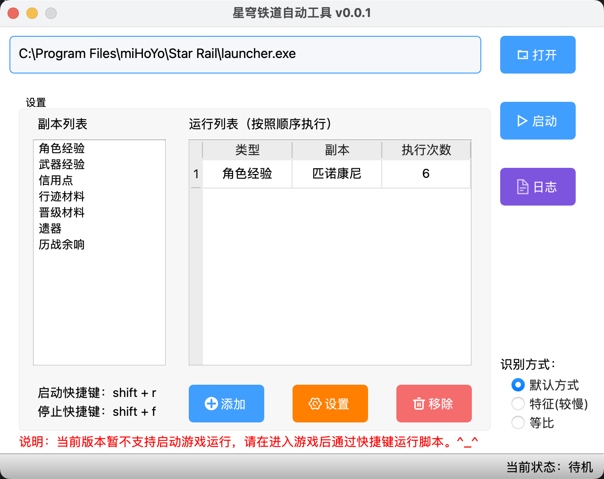

<div align="center">

<br/>
<br/>

  <h1 align="center">
    StarRail Auto Tools
  </h1>
  <h4 align="center">
    星 穹 铁 道，一款自动执行日常任务的脚本
  </h4>
</div>

<p align="center">
    <a href="#">
        
    </a>        
    <a href="#">
        
    </a>
</p>

<div align="center">
  
</div>
<br>

## 项目介绍
> 星穹铁道自动化工具。

本项目主要用于日常任务清体力使用，目前还在开发阶段...

> 敲黑板
```
本项目主要根据个人使用习惯进行开发，目前仅开发个人使用，有兴趣的小伙伴也可以Fork去使用。
```

## 当前系统版本
```
0.0.2
```

## 相关技术

| 库名 | 版本号 |
| --  | -- |
| Python | 3.11.6 |
| opencv | 4.6.0.66 |
| paddleocr | 2.6.0 |
| pyside6 | 6.6.2 |
| pyautogui | 0.9.54 |
| keyboard | 0.13.5 |

## 帮助

1. 环境和库安装
~~~
# 创建conda环境
conda create --name star-rail python=3.11.6
# 库安装
conda install pyside6
conda install keyboard
python -m pip install playsound
python -m pip python-opencv==4.6.0.66
python -m pip install paddlepaddle -i https://mirror.baidu.com/pypi/simple
python -m pip install paddleocr -i https://mirror.baidu.com/pypi/simple
python -m pip install pyautogui 
~~~

2. 报错问题

Q：提示`NameError: name 'predict_system' is not defined`
A：修改paddleocr.py代码
~~~
54行,这样改from ppstructure.predict_system import StructureSystem, save_structure_res, to_excel,TextSystem
575行,这样改class PaddleOCR(TextSystem):
~~~